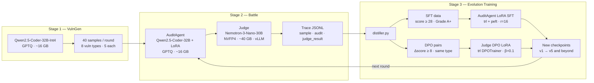

# SSPilot

[](https://www.python.org/)
[](https://developer.nvidia.com/cuda-toolkit)
[](https://www.nvidia.com/en-us/data-center/dgx-spark/)
[](https://www.nvidia.com/)

**Self-evolving code security auditing agent.** SSPilot closes the full loop from vulnerable code generation to model training — each round produces better audits, which feed back into the next.

---

## What SSPilot Does

Most LLM security tools run inference once and stop. SSPilot runs a **continuous improvement cycle**:

```
VulnGen  →  AuditAgent  →  Judge  →  Distiller  →  SFT + DPO  →  Next Round
  ↑                                                                     │
  └─────────────────────── improved checkpoints ───────────────────────┘
```

After each round, high-quality audit traces are distilled into supervised fine-tuning data for AuditAgent and preference pairs for Judge alignment. The system gets sharper with every iteration.

---

## Key Contributions

| What | How |
|---|---|
| Controlled vulnerability corpus | Qwen2.5-Coder-32B generates 40 samples/round across 8 categories with ground truth |
| Structured 4-dimension scoring | Judge scores Detection / Precision / Depth / Remediation on 0–10 each (total 0–40) |
| Progressive LoRA compounding | Each SFT checkpoint merges the previous adapter before training — knowledge compounds across rounds |
| Dual training tracks | AuditAgent SFT (active) + Judge DPO (infrastructure ready) — both sides of the loop can improve |
| Reproducible JSONL traces | Every round produces verifiable traces with sample, audit, and judge result |

---

## Architecture



---

## Models

| Role | Model | Quant | Memory | Function |
|---|---|---|---|---:|
| VulnGen | Qwen2.5-Coder-32B-Instruct | GPTQ INT4 | ~16 GB | Generate vulnerable code with ground truth labels |
| AuditAgent | Qwen2.5-Coder-32B-Instruct + LoRA | GPTQ INT4 + adapter | ~16 GB | Produce structured security audit reports |
| Judge | NVIDIA-Nemotron-3-Nano-30B-A3B-NVFP4 | NVFP4 | ~40 GB | Score audits on 4 dimensions via vLLM API |

Total peak memory budget: **~72 GB** (stage-wise loading on 119 GB DGX Spark GB10).

---

## Results

### Round summary (40 samples each, 8 vuln types balanced)

| Round | Avg Score /40 | S | A | B | C | D | Training Applied |
|---|---:|---:|---:|---:|---:|---:|---|
| Round 1 (baseline) | **30.65** | 5 | 30 | 1 | 4 | — | None |
| Round 2 | **31.05** | 7 | 28 | 2 | 3 | — | SFT v1–v2 |
| Round 3 | **30.90** | 6 | 29 | 2 | 2 | 1 | SFT v3–v4 |

S+A rate across all rounds: **87.5% → 87.5% → 87.5%** with S-grade count rising from 5 to 7.

### Per-dimension trend

| Dimension | R1 | R2 | R3 | Δ (R1→R3) |
|---|---:|---:|---:|---:|
| Detection | 7.7 | 7.8 | 7.8 | +0.1 |
| Precision | 8.5 | 8.4 | 8.3 | −0.2 |
| Depth | 7.2 | 7.3 | 7.3 | +0.1 |
| Remediation | 7.3 | 7.5 | 7.5 | **+0.2** |

Remediation shows the clearest improvement — consistent with SFT training on high-quality fix guidance.

### Vulnerability difficulty map (Round 1 baseline)

| Type | Avg /40 | Difficulty |
|---|---:|---|
| sqli | 36.0 | Easy |
| xss | 33.8 | Easy |
| unsafe_deser | 32.8 | Medium |
| info_leak | 32.4 | Medium |
| hardcoded_secret | 31.8 | Medium |
| path_traversal | 31.4 | Medium |
| ssrf | 29.8 | Medium |
| **logic** | **17.2** | **Hard — primary bottleneck** |

`logic` scores 14 points below the next-hardest type. Targeted data augmentation is the clearest path to overall score improvement.

---

## Scoring Rubric

| Dimension | What the Judge evaluates |
|---|---|
| Detection | Completeness — are all vulnerabilities found? |
| Precision | Accuracy — are findings correct with low false positives? |
| Depth | Root-cause and exploit-chain analysis quality |
| Remediation | Actionability and correctness of suggested fixes |

Grades: `S(36–40)` · `A(28–35)` · `B(20–27)` · `C(12–19)` · `D(4–11)` · `F(0–3)`

---

## Environment Setup

### Prerequisites

| Requirement | Version | Notes |
|---|---|---|
| OS | Ubuntu 22.04 + | Tested on DGX Spark GB10 |
| Python | 3.11 | via conda |
| CUDA | 13.0 | bundled with torch build |
| Docker | 24+ | required for vLLM Judge container |
| NVIDIA Container Toolkit | latest | `nvidia-docker2` or `nvidia-ctk` |
| GPU Memory | ≥ 72 GB | stage-wise: VulnGen ~16 GB → AuditAgent ~16 GB → Judge ~40 GB |

### 1 — Create conda environment

```bash
conda create -n sspilot python=3.11 -y
conda activate sspilot
```

### 2 — Install Python dependencies

```bash
pip install -r requirements.txt

# torch is built against CUDA 13.0; install from PyTorch nightly/cu130 index if the
# default wheel does not match your driver:
#   pip install torch==2.11.0+cu130 --index-url https://download.pytorch.org/whl/cu130
```

### 3 — Verify Docker + GPU access

```bash
docker run --rm --gpus all nvidia/cuda:12.6.0-base-ubuntu22.04 nvidia-smi
```

### 4 — Place model weights

SSPilot expects models under `/models/` (configurable in `scripts/config.py`):

```
/models/
├── Qwen2.5-Coder-32B-Instruct-GPTQ-Int4/   # VulnGen + AuditAgent
└── NVIDIA-Nemotron-3-Nano-30B-A3B-NVFP4/   # Judge (loaded by vLLM container)
```

Download from HuggingFace or NGC, then move/symlink to the paths above.

```bash
# Example — HuggingFace CLI
pip install huggingface_hub
huggingface-cli download Qwen/Qwen2.5-Coder-32B-Instruct-GPTQ-Int4 \
    --local-dir /models/Qwen2.5-Coder-32B-Instruct-GPTQ-Int4

huggingface-cli download nvidia/NVIDIA-Nemotron-3-Nano-30B-A3B-NVFP4 \
    --local-dir /models/NVIDIA-Nemotron-3-Nano-30B-A3B-NVFP4
```

### 5 — Download AuditAgent LoRA adapter

The trained LoRA checkpoint (`audit_sft_v5/final`) is too large for this repository (`checkpoints/` is `.gitignore`d). Download it from ModelScope:

**Model:** [zechlei/sspilot-auditagent-lora-v5](https://www.modelscope.cn/models/zechlei/sspilot-auditagent-lora-v5)

```bash
pip install modelscope
modelscope download --model zechlei/sspilot-auditagent-lora-v5 \
    --local_dir checkpoints/audit_sft_v5/final
```

Or download from the ModelScope **Files** tab and extract to `checkpoints/audit_sft_v5/final`.

The downloaded path must match `lora_path` in `scripts/config.py` (`MODELS["agent"]["lora_path"]`).

---

## Quick Start

```bash
# 1. Activate environment
conda activate sspilot

# 2. Launch demo (starts vLLM Judge container + Flask UI)
bash start_demo.sh          # → http://localhost:8888

# 3. Run a single battle round (40 samples)
bash run.sh battle 1 40

# 4. Run 5 evolution rounds with training
bash run.sh evolve 5 40

# 5. Compare round trends
bash run.sh compare
```

---

## Repository Layout

```text
sspilot/
├── scripts/
│   ├── config.py           model paths, battle params, memory safety config
│   ├── vulngen.py          Stage 1: vulnerable code generation
│   ├── audit_agent.py      Stage 2: AuditAgent inference
│   ├── judge.py            Stage 2: Judge scoring and grade mapping
│   ├── battle_patched.py   Stage 2: vLLM-based battle orchestration
│   ├── distiller.py        Stage 3: SFT and DPO data extraction
│   ├── sft_v5.py           Stage 3: AuditAgent LoRA SFT (active)
│   ├── dpo_train.py        Stage 3: Judge DPO training (ready)
│   ├── trace.py            JSONL trace persistence
│   └── compare.py          multi-round trend analysis
├── configs/
│   ├── nemo_sft.yaml       NeMo SFT LoRA config
│   └── nemo_dpo.yaml       NeMo DPO LoRA config
├── demo/                   Flask demo server + web UI
├── datasets/               generated and distilled datasets
├── traces/                 round traces (JSONL, one file per round)
├── reports/                battle and round JSON reports
├── training/               standalone training entrypoints
├── run.sh                  CLI entry for all pipeline modes
└── start_demo.sh           one-command demo bootstrap
```

---

## Technical Report

Full architecture, training design, engineering details, and experiment analysis: [`docs/technical_report.md`](docs/technical_report.md)
