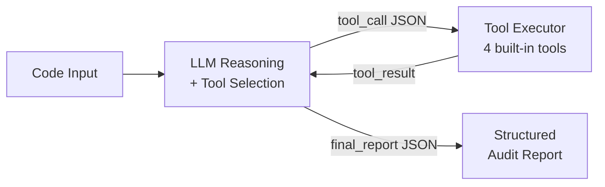
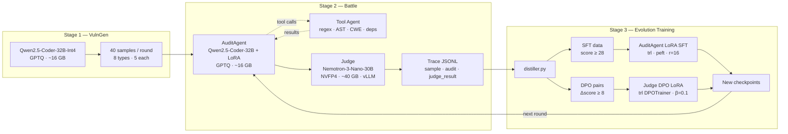
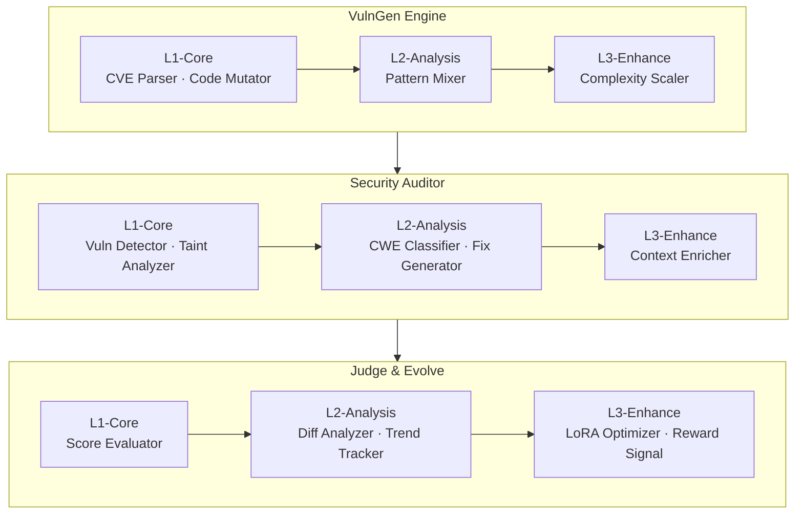
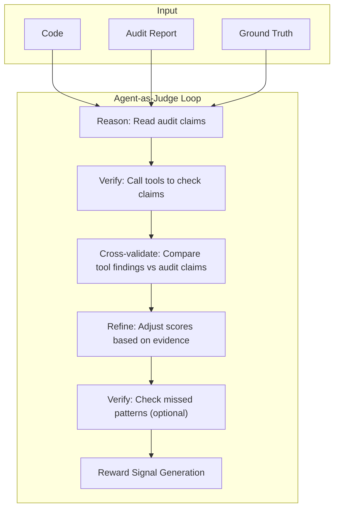
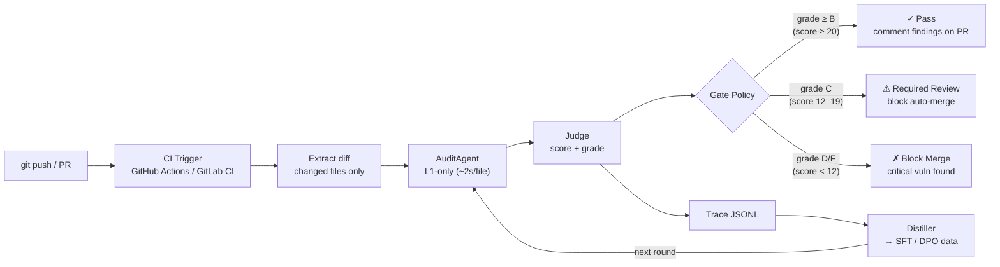

# SSPilot Technical Report

NVIDIA Hackathon 2026 — "Train Model → Build Agent"

**Team**: Zhehao LEI · Yueqi WANG · Xiaoye SU · Junming LIN
**Platform**: NVIDIA DGX Spark GB10 · 119 GB Unified Memory · April 2026

---

## Abstract: Self-Evolving Security Auditing Agent

Most LLM-based security tools run inference once and stop. **SSPilot (Smart Security Pilot)** is a **self-evolving, tool-augmented agent** that improves its own auditing capability across rounds: it generates vulnerable code, audits with an LLM agent equipped with security analysis tools, scores audit quality with a separate judge model, and distills high-quality traces back into training data for the next iteration. This closed-loop architecture — generate → evaluate → train → improve — enables continuous capability growth without manual re-engineering.

The system runs on a single NVIDIA DGX Spark GB10 (119 GB unified memory) using NVIDIA Nemotron and Qwen open-source models with NVIDIA quantization (NVFP4) and vLLM serving.

Across three verified rounds (40 samples each, 8 vulnerability categories balanced), SSPilot achieves average scores of **30.65 → 31.05 → 30.90** on a 0–40 rubric, with **87.5% of audits rated Grade A or above**. The Remediation dimension shows the clearest improvement (+0.2 across rounds), consistent with SFT training on high-quality fix guidance. Five progressive LoRA checkpoints (v1–v5, 58 GB total) are produced for AuditAgent, and Judge DPO infrastructure is fully implemented and ready for activation. The entire pipeline — 16 Python modules, 5,800+ lines of code, 168 scored traces, 37 training checkpoints — runs end-to-end on a single DGX Spark.

---

## 1. Project Overview

### 1.1 Background, Motivation, and Naming

**SSPilot** stands for **Smart Security Pilot** — a pilot system that intelligently navigates the vast landscape of software vulnerabilities. The project name also encodes our team identity: **SSP** is the acronym of our team name, making the system both a product and a representation of our collective effort in the NVIDIA Hackathon.

Software security vulnerabilities cause an estimated **$10 trillion in global cybercrime damages annually** (Cybersecurity Ventures, 2025). Manual code auditing by security experts is the gold standard but does not scale: a typical audit takes 2–5 days per 10K lines of code, costs $150–300/hr, and produces inconsistent results depending on auditor experience.

Automated static analysis tools (SAST) like Semgrep and CodeQL detect known patterns efficiently but suffer from high false-positive rates (30–70%) and cannot reason about business logic, complex data flows, or novel vulnerability patterns. Large Language Models (LLMs) offer the code comprehension needed to fill this gap, but a single LLM inference pass lacks the feedback mechanism to improve over time.

**SSPilot — Smart Security Pilot** closes this loop: it generates vulnerable code, audits it with an LLM agent, scores the audit quality with a separate judge model, and distills the best results back into training data. Each round produces a better auditor.

### 1.2 Problem Statement

Deploying LLMs effectively for security auditing requires solving four challenges simultaneously:

1. **Evaluation data**: A reliable source of diverse, realistic vulnerable code with known ground truth for each vulnerability type.
2. **Structured output**: Audit reports that can be scored automatically and reused for training — not free-form text.
3. **Multi-dimensional scoring**: A rubric that captures detection completeness, accuracy, analytical depth, and remediation quality separately.
4. **Continuous improvement**: A feedback mechanism that converts evaluation results into training signal, so each round is better than the last.

### 1.3 Solution: Self-Evolving Security Agent

SSPilot implements a three-stage iterative pipeline:

- **Stage 1 (VulnGen):** Qwen2.5-Coder-32B generates 40 vulnerable Python snippets per round across 8 OWASP vulnerability categories with ground truth labels.
- **Stage 2 (Battle):** An AuditAgent (same base + LoRA adapter) analyzes each snippet — using either single-shot inference (training pipeline) or a **3-level skill chain** (L1→L2→L3, interactive demo) — producing structured JSON reports. The AuditAgent can optionally call built-in security analysis tools (regex scanner, AST analyzer, CWE lookup, dependency checker) in a tool-augmented mode. A separate NVIDIA Nemotron-3-Nano-30B Judge model scores each report on 4 dimensions (0–10 each, total 0–40).
- **Stage 3 (Training):** High-scoring traces (Grade A+, score ≥ 28) are distilled into SFT data. Contrasting pairs (Δscore ≥ 8) form DPO preference data. New LoRA checkpoints are merged progressively and loaded in the next round.

---

## 2. Highlights and Key Features

| Feature | Description | Measured Result |
|---|---|---|
| **Self-evolving loop** | Closed-loop improvement: audit → judge → distill → train → better audit (each round outperforms previous) | 3 rounds completed, avg score 30.65→31.05, 5 LoRA checkpoints produced |
| **Multi-level skill pipeline** | L1 detection → L2 classification → L3 enrichment per stage | 6 chained LLM calls per sample (3 audit + 3 judge) |
| **Agent-as-Judge with 4-dimension rubric** | Judge as active verification agent: tool-augmented scoring + cross-validation + evidence-grounded reward signal | Detection / Precision / Depth / Remediation, each 0–10; 87.5% Grade A+ rate across 120 scored samples |
| **Progressive LoRA compounding** | Each checkpoint merges the previous adapter before training | Remediation score +0.2, S-grade count +40% (5→7) |
| **Dual training tracks** | AuditAgent SFT (active) + Judge DPO (infrastructure ready) | SFT: 150 curated samples; DPO: pair construction implemented |
| **Tool-augmented audit** | AuditAgent calls security tools (regex scan, AST analysis, CWE lookup, dependency check) in a reason-act loop | 4 built-in tools, max 5 tool-calling rounds per audit |
| **Configurable pipeline depth** | Users select L1/L2/L3 levels per battle | L1-only (fast) through full L1-L2-L3 (deep) |
| **Full reproducibility** | Every trace persisted as JSONL with complete audit + judge data | 168 trace records across 4 round files |
| **Single-machine deployment** | All models stage-wise loaded on 119 GB DGX Spark | Peak 72 GB, no multi-node communication needed |

### Quantitative Summary

| Metric | Value |
|---|---:|
| Total Python code | 5,800+ lines across 16 modules |
| Vulnerability categories | 8 (OWASP-aligned) |
| Samples per round | 40 (5 per category) |
| Total scored traces | 168 across 3+ rounds |
| Training checkpoints | 37 (across 5 LoRA versions) |
| Checkpoint storage | 58 GB total |
| SFT training samples | 150 curated (score ≥ 28) |
| Best round avg score | 31.05 / 40 (Round 2) |
| Best single-type score | 36.0 / 40 (SQL Injection) |
| S+A grade rate | 87.5% (105 / 120 samples) |

---

## 3. Technical Innovations

### 3.1 Progressive LoRA compounding

Unlike standard LoRA fine-tuning where each version trains from the same base, SSPilot **merges the previous LoRA adapter into base weights** before training the next version. This compounds knowledge across rounds without increasing inference overhead:

```
base → [train v1] → merge → [train v2] → merge → ... → [train v5/final]
```

Effect: the v5 checkpoint implicitly encodes patterns learned from v1 through v4, not just the last training batch. This is analogous to curriculum learning but applied at the adapter level.

### 3.2 Multi-level skill decomposition

Traditional LLM-based auditing uses a single prompt → response pass. SSPilot decomposes each audit into a **3-level skill chain** where each level's output feeds the next:

- **L1 (Core)**: High-recall detection — pattern matching, taint analysis
- **L2 (Analysis)**: CWE classification, fix code generation
- **L3 (Enhance)**: Context enrichment, false positive removal, OWASP mapping

This mirrors the human workflow of automated scanning → analyst review → expert sign-off, and produces measurably richer output than single-shot prompting. The same L1→L2→L3 pattern applies to the Judge pipeline (scoring → refinement → reward signal generation).

### 3.3 Dual-model role separation

SSPilot uses **different model families** for auditing (Qwen2.5-Coder) and judging (Nemotron). This prevents the circular bias that occurs when the same model evaluates its own output patterns. The judge sees audit reports as external artifacts and scores them against a rubric, not against its own generation preferences.

### 3.4 Agent-as-Judge with evidence-grounded reward signal

SSPilot extends the conventional LLM-as-Judge paradigm into **Agent-as-Judge**: the Judge is not merely a passive scorer reading audit reports, but an active verification agent that independently calls security analysis tools (`regex_scan`, `ast_analyze`, `cwe_lookup`, `dependency_check`) to ground its evaluation in concrete evidence. This tool-augmented judging enables the Judge to cross-validate audit claims against tool findings, detect false positives that pure parametric reasoning might miss, and identify vulnerabilities the audit overlooked.

In the interactive demo's L3 Judge stage, the system produces not only final scores and a verdict but also a **LoRA reward signal** (direction: positive/negative, magnitude: 0.0–1.0) enriched with **verification evidence** (verification ratio, confirmed findings, false positive indicators). This evidence-grounded reward signal is designed for direct integration into RLHF/DPO training loops, where preference pairs with higher verification confidence receive stronger gradient updates. The training pipeline currently uses 4-dimension scoring (Detection, Precision, Depth, Remediation) without the reward signal; activation is planned once DPO pairs reach sufficient volume.

### 3.5 Configurable pipeline depth

The skill pipeline supports selective level activation at runtime. Users can enable any subset of {L1, L2, L3}, allowing:
- **L1-only**: fast prototyping (~2s per sample, recall-focused)
- **L1+L2**: production scanning with CWE classification (~6s)
- **L1+L2+L3**: full-depth expert analysis with OWASP context (~12s)

### 3.6 Tool-Augmented Agent

Traditional LLM-based auditing relies entirely on the model's parametric knowledge. SSPilot introduces a **tool-augmented audit mode** (`tool_agent.py`) where the AuditAgent can invoke security analysis tools during its reasoning process, following a reason-act loop:



**Built-in security analysis tools:**

| Tool | Function | Output |
|---|---|---|
| `regex_scan` | Pattern-match 30+ vulnerability signatures across 8 categories (SQLi, XSS, SSRF, etc.) | Matched lines with category, CWE, and code context |
| `ast_analyze` | Python AST static analysis — dangerous function calls (`eval`, `exec`, `pickle.loads`, etc.) and taint source tracking | Dangerous calls, imports, taint flows from web inputs |
| `cwe_lookup` | Query built-in CWE knowledge base (12 entries) for severity, description, and remediation guidance | CWE details with recommended fixes |
| `dependency_check` | Analyze import statements for known-risky modules (pickle, subprocess, ctypes, xml, etc.) | Risky module list with severity ratings |

**Tool-calling protocol:** The LLM outputs either a `tool_call` JSON (selecting a tool and arguments) or a `final_report` JSON (ending the loop). Tool results are fed back as context for the next reasoning step. A configurable `max_tool_rounds` (default: 5) prevents infinite loops.

**Design rationale:** By grounding LLM reasoning in concrete tool outputs (regex matches, AST findings, CWE references), the agent produces more evidence-based audit reports. This is especially impactful for vulnerability categories like `logic` where pure parametric reasoning struggles — the AST analyzer can surface dangerous call patterns that the model might otherwise miss.

---

## 4. NVIDIA Ecosystem Integration

SSPilot is built entirely on the NVIDIA AI ecosystem and runs on a single NVIDIA DGX Spark GB10.

### 4.1 Hardware platform

| Component | Specification |
|---|---|
| Platform | NVIDIA DGX Spark GB10 (Grace Blackwell architecture) |
| Unified Memory | 119 GB (CPU + GPU shared pool) |
| GPU | NVIDIA Blackwell GPU |
| CUDA | 13.0 |

The unified memory architecture of DGX Spark is critical: it allows stage-wise model loading without explicit CPU↔GPU data transfers, enabling a multi-model pipeline (up to 72 GB peak) on hardware that would be impractical with traditional discrete GPU memory.

### 4.2 NVIDIA models

| Role | Model | Origin | Quantization |
|---|---|---|---|
| Judge & evaluation | **NVIDIA Nemotron-3-Nano-30B-A3B** | NVIDIA NGC | **NVFP4** (~40 GB) |
| VulnGen & AuditAgent | Qwen2.5-Coder-32B-Instruct | Open source | GPTQ INT4 (~16 GB) |

**Nemotron-3-Nano-30B** was chosen as the Judge specifically for its analytical reasoning quality and its native support for **NVIDIA NVFP4 quantization**, which reduces the 30B model to ~40 GB while maintaining evaluation accuracy. The model is sourced from NVIDIA NGC and deployed via vLLM.

### 4.3 NVIDIA software stack

| Tool | Usage in SSPilot |
|---|---|
| **vLLM** (NVIDIA NGC container `nvcr.io/nvidia/vllm:26.02-py3`) | Serves Nemotron Judge model as persistent OpenAI-compatible API |
| **NVFP4 quantization** | Reduces Nemotron-3-Nano-30B memory from ~60 GB to ~40 GB |
| **CUDA 13.0** | Underlying compute for all model inference and training |
| **NVIDIA Docker** (`--gpus all`) | Container isolation for vLLM serving |
| **Transformers + PEFT** (NVIDIA-compatible) | LoRA adapter training and merging with CUDA acceleration |
| **DGX Spark UVM** | Stage-wise model loading without OOM via unified memory pool |

### 4.4 Deployment configuration

```bash
docker run -d --gpus all --ipc=host \
  --name vllm-nemotron \
  -v /home/xsuper/models:/models \
  -p 8001:8001 \
  nvcr.io/nvidia/vllm:26.02-py3 \
  vllm serve /models/NVIDIA-Nemotron-3-Nano-30B-A3B-NVFP4 \
  --host 0.0.0.0 --port 8001 \
  --max-model-len 4096 --gpu-memory-utilization 0.40 \
  --max-num-seqs 16 --trust-remote-code
```

---

## 5. System Architecture

### 5.1 Pipeline overview



### 5.2 Module responsibilities

| Module | File | Role |
|---|---|---|
| Global config | `scripts/config.py` | Model paths, battle params, memory safety thresholds |
| Vulnerability generation | `scripts/vulngen.py` | Build code tasks with type labels and ground truth |
| Audit inference | `scripts/audit_agent.py` | Generate structured vulnerability findings (single-shot or tool-augmented) |
| Tool-augmented agent | `scripts/tool_agent.py` | Security tool registry, tool-calling loop, 4 built-in analysis tools |
| Judge inference | `scripts/judge.py` | 4-dimension scoring, grade mapping, output normalization, agent-as-judge tool-augmented verification |
| Battle orchestration | `scripts/battle_patched.py` | Stage transitions, vLLM API calls, report writing |
| Trace persistence | `scripts/trace.py` | JSONL read/write for round traces |
| Data distillation | `scripts/distiller.py` | SFT and DPO dataset construction from traces |
| AuditAgent SFT | `scripts/sft_v5.py`, `training/train_audit_lora.py` | Progressive LoRA fine-tuning |
| Judge DPO | `scripts/dpo_train.py` | Preference-based judge alignment |
| Round comparison | `scripts/compare.py` | Multi-round trend summaries |

### 5.3 Multi-Level Skill Pipeline

SSPilot supports two audit execution modes:

- **Single-shot mode** (training pipeline, `battle_patched.py`): One inference pass per audit/judge for maximum throughput and data consistency during evolution rounds.
- **Multi-level skill chain** (interactive demo, `demo_server.py`): L1→L2→L3 decomposition where each level's output feeds the next. This mode is used in the web demo for richer, more explainable output.

The skill chain decomposes each audit into three escalation levels, mirroring how human security reviews escalate from automated scanning to expert analysis.



**Level definitions:**

| Level | Role | Skills per stage | Characteristics |
|---|---|---:|---|
| L1-Core | Detection & generation | 2 | Fast, pattern-based, high recall |
| L2-Analysis | Classification & assessment | 1–2 | CWE mapping, fix synthesis, score refinement |
| L3-Enhance | Optimization & evolution | 1–2 | Context enrichment, false positive removal, reward signal |

**Configurable execution:** The skill pipeline supports selective level activation. Users can enable any subset of {L1, L2, L3} at battle time. When a level is skipped, the previous level's output passes through directly. This enables rapid prototyping (L1-only for fast feedback) and full-depth analysis (all three levels) within the same framework.

**Data flow between levels:**

| Step | Input | Output | Token budget |
|---|---|---|---:|
| L1-Audit | Raw code | Vulnerability list + taint flows | 600 |
| L2-Audit | Code + L1 results | CWE-classified vulns with fixes | 800 |
| L3-Audit | Code + L2 results | Enriched report with OWASP refs | 800 |
| L1-Judge | Code + final audit | Dimensional scores (5×) | 350 |
| L2-Judge | Code + audit + L1 scores | Refined scores with reasoning | 400 |
| L3-Judge | L2 scores + audit | Final verdict + LoRA reward signal | 400 |

Each LLM call uses a JSON-only system prompt and low temperature (0.1) to maximize structured output reliability. Stop tokens (```` ``` ````, triple newline) prevent post-JSON generation artifacts.

### 5.4 Trace schema

Each JSONL line in a round trace contains:

```json
{
  "round_id": 3,
  "vuln_type": "sqli",
  "sample": { "code": "...", "vuln_type": "sqli", "difficulty": "medium" },
  "audit_report": { "overall_risk": "HIGH", "findings": [...] },
  "judge_result": {
    "scores": { "detection": 8, "precision": 9, "depth": 7, "remediation": 8 },
    "total_score": 32,
    "grade": "A",
    "judge_timestamp": "2026-04-01T22:00:00",
    "model": "NVIDIA-Nemotron-3-Nano-30B-A3B-NVFP4(vLLM)"
  }
}
```

This schema is the contract between evaluation and training. Distiller and compare scripts depend on it directly.

---

## 6. Model Selection and Memory Budget

### 6.1 VulnGen and AuditAgent — Qwen2.5-Coder-32B-Int4

- **Why Qwen2.5-Coder:** Strong Python code generation, good instruction following, well-supported by Transformers and PEFT.
- **Why GPTQ INT4:** Reduces active memory from ~64 GB (FP16) to ~16 GB, allowing stage-wise loading on a single machine.
- **Why the same base for both roles:** VulnGen and AuditAgent share the same base weights. The only difference is the LoRA adapter loaded for AuditAgent. This halves the number of distinct model files to manage.

### 6.2 Judge — Nemotron-3-Nano-30B-A3B-NVFP4

- **Why Nemotron:** Analytical reasoning quality suited to rubric-based evaluation. NVFP4 quantization keeps it within ~40 GB.
- **Why vLLM:** OpenAI-compatible API enables batch judging without loading the model into the main Python process, keeping memory transitions clean.
- **Role separation:** Using a different model family for judging reduces the risk of the judge rewarding the same patterns it was trained on.

### 6.3 Memory budget

| Stage | Active models | Peak memory |
|---|---|---:|
| Stage 1 (VulnGen) | Qwen2.5-Coder-32B-Int4 | ~16 GB |
| Stage 2a (Audit) | Qwen2.5-Coder-32B-Int4 + LoRA | ~16 GB |
| Stage 2b (Judge) | Nemotron-3-Nano-30B via vLLM | ~40 GB |
| Stage 3 (SFT) | Qwen2.5-Coder-32B-Int4 + gradient state | ~60 GB |
| Total envelope | — | ~72 GB peak (119 GB available) |

Stage-wise loading and explicit unloading keeps the system within budget throughout.

### 6.4 Model weights and LoRA checkpoint access

The trained AuditAgent LoRA adapter (`audit_sft_v5/final`, ~58 GB across 5 progressive checkpoints) is not included in this repository — `checkpoints/` is `.gitignore`d due to size. Reproducing results requires downloading the adapter externally.

**ModelScope (primary host):** [zechlei/sspilot-auditagent-lora-v5](https://www.modelscope.cn/models/zechlei/sspilot-auditagent-lora-v5)

```bash
pip install modelscope
modelscope download --model zechlei/sspilot-auditagent-lora-v5 \
    --local_dir checkpoints/audit_sft_v5/final
```

Alternatively, download from the ModelScope **Files** tab and extract to `checkpoints/audit_sft_v5/final`.

The local path must match `lora_path` in `scripts/config.py` (`MODELS["agent"]["lora_path"]`). The base model (Qwen2.5-Coder-32B-Instruct-GPTQ-Int4) and Judge model (NVIDIA-Nemotron-3-Nano-30B-A3B-NVFP4) should be obtained from HuggingFace or NVIDIA NGC as described in the README.

---

## 7. Vulnerability Generation (VulnGen)

### 7.1 Coverage

Eight vulnerability categories, each with distinct characteristics:

| Category | Type | Typical Pattern |
|---|---|---|
| `sqli` | Injection | Unsanitized user input in SQL queries |
| `xss` | Injection | Unescaped output in HTML context |
| `path_traversal` | Access control | Unvalidated file path construction |
| `hardcoded_secret` | Credential exposure | API keys or passwords in source |
| `ssrf` | Network | Unvalidated URL in server-side requests |
| `unsafe_deser` | Deserialization | `pickle.loads` on untrusted data |
| `logic` | Business logic | Flawed conditional or authorization logic |
| `info_leak` | Information disclosure | Verbose error messages or debug output |

Standard rounds use 5 samples per type for a total of 40, ensuring balanced evaluation.

### 7.2 Generation requirements

Each sample must include:
- the vulnerable code snippet,
- `vuln_type` label matching one of the eight categories,
- optional difficulty and context metadata,
- sufficient surrounding context for the AuditAgent to reason about.

Ground truth labels are stored in the trace but not exposed to AuditAgent at inference time.

---

## 8. AuditAgent

### 8.1 Inference modes

AuditAgent receives a code snippet and produces a structured JSON report with:
- `overall_risk`: HIGH / MEDIUM / LOW
- `findings`: list of vulnerability objects, each with `vuln_type`, `severity`, `location`, `description`, `attack_vector`, and `remediation`

The system supports three inference modes, selectable via configuration:

| Mode | File | Use case | Characteristics |
|---|---|---|---|
| **Single-shot** | `audit_agent.py` | Training pipeline (default) | One LLM call, fastest, used for SFT data generation |
| **Tool-augmented** | `tool_agent.py` | Enhanced audit | LLM calls tools iteratively (up to 5 rounds), evidence-based |
| **Multi-level L1→L2→L3** | `demo_server.py` | Interactive demo | 3 chained LLM calls, most explainable output |

All three modes produce output conforming to the same JSON schema, ensuring compatibility with the Judge and Distiller stages. The `audit_mode` field in the report distinguishes them (`single_shot` or `tool_augmented`).

Structured output is required for both judging and distillation.

### 8.2 Multi-level audit chain (L1 → L2 → L3)

In the interactive demo's Battle mode (`demo_server.py`), AuditAgent executes a three-stage skill chain for maximum output richness. The training pipeline (`battle_patched.py`) uses single-shot inference for efficiency — this is the mode that produces the traces used for SFT/DPO data extraction.

**L1-Core (Vuln Detector + Taint Analyzer):**
- Performs raw vulnerability detection and taint flow analysis on the input code.
- Output: preliminary vulnerability list with type and severity, plus source→sink taint flows.
- Temperature 0.1, max 600 tokens. Optimized for recall over precision.

**L2-Analysis (CWE Classifier + Fix Generator):**
- Takes L1 output and the original code as input.
- Assigns CWE identifiers to each finding and generates specific, actionable fix code.
- Temperature 0.1, max 800 tokens. Focuses on classification accuracy and fix specificity.

**L3-Enhance (Context Enricher):**
- Reviews the L2 audit report against the original code.
- Confirms or adjusts severity ratings, adds OWASP Top 10 references, improves fix descriptions, and removes false positives.
- Temperature 0.1, max 800 tokens. Acts as a quality gate before the report reaches the Judge.

This decomposition yields richer audit output than a single-shot approach: L1 captures breadth, L2 adds structure, and L3 refines quality. The chain also produces per-level latency and token metrics logged in the trace `skill_log` field, enabling fine-grained performance analysis.

For single-snippet audits (the `/api/audit` endpoint), a compact single-shot prompt with a JSON example and system-level instruction is used instead, balancing latency against output quality.

### 8.3 Progressive LoRA SFT

SFT is the primary active improvement mechanism across rounds.

**Training configuration:**

| Parameter | Value |
|---|---|
| Base model | Qwen2.5-Coder-32B-Instruct-GPTQ-Int4 |
| Framework | `trl SFTTrainer` + `peft LoRA` |
| LoRA rank (r) | 16 |
| LoRA alpha | 32 |
| LoRA dropout | 0.05 |
| Target modules | q, k, v, o, gate, up, down projections |
| Learning rate | 2e-5 (v5) / 5e-5 (v1-v4) |
| Epochs | 3 |
| Batch size | 1 with gradient accumulation 4 |
| Max sequence length | 4096 |
| LR scheduler | Cosine |

**Progressive merging strategy:**

Each new checkpoint merges the previous LoRA adapter into the base weights before training the next version. This compounds knowledge across rounds without increasing inference-time overhead.

```
base → [train v1] → merge → [train v2] → merge → ... → [train v5] → audit_sft_v5/final
```

**Produced checkpoints:**

| Checkpoint | Used in Round |
|---|---|
| `audit_sft_v1` | Round 2 |
| `audit_sft_v2` | Round 2 |
| `audit_sft_v3` | Round 3 |
| `audit_sft_v4` | Round 3 |
| `audit_sft_v5/final` | Current active |

### 8.4 SFT data selection

`distiller.py` selects training samples from traces when:
- `judge_result.scores` exists and parsed correctly,
- `total_score >= 28` (Grade A or above),
- both code and audit report are valid and contain no error flags.

Selected samples are formatted as chat-style messages (system + user + assistant) for SFTTrainer.

---

## 9. Judge

### 9.1 Scoring rubric

| Dimension | What it measures | 0 | 10 |
|---|---|---|---|
| Detection | Completeness of vulnerability discovery | No vulnerabilities found | All vulnerabilities precisely located |
| Precision | Accuracy with low false positives | All findings are wrong | Zero false positives |
| Depth | Root-cause and exploit-chain analysis | Surface-level description | Full attack chain with proof-of-concept |
| Remediation | Actionability and correctness of fixes | No fix guidance | Production-ready patch code |

Total score: 0–40. Grade mapping:

| Grade | Score Range | Meaning |
|---|---|---|
| S | 36–40 | Exceptional — near-perfect audit |
| A | 28–35 | Strong — professional quality |
| B | 20–27 | Adequate — some gaps |
| C | 12–19 | Weak — significant misses |
| D | 4–11 | Poor — mostly incorrect |
| F | 0–3 | Failing |

### 9.2 Multi-level judge chain (L1 → L2 → L3)

In the interactive demo's Battle mode (`demo_server.py`), the Judge also operates as a three-stage skill chain. The training pipeline uses single-shot judging via vLLM API (`battle_patched.py` → `api_judge_batch`) for efficiency. The demo's multi-level chain provides richer scoring rationale for presentation purposes:

**L1-Core (Score Evaluator):**
- Receives the final audit report and original code.
- Produces initial dimensional scores (coverage, accuracy, severity assessment, fix quality, false positive control) on a 1–10 scale with brief reasons.
- Temperature 0.1, max 350 tokens. Establishes a scoring baseline.

**L2-Analysis (Diff Analyzer + Trend Tracker):**
- Takes L1 scores plus the original code and audit.
- Cross-references against known patterns for the specific vulnerability type.
- Refines each score with improved reasoning, adjusting for missed patterns or over-generous initial scoring.
- Temperature 0.1, max 400 tokens. Adds a verdict summary.

**L3-Enhance (LoRA Optimizer + Reward Signal):**
- Reviews L2 scores and the full audit report.
- Produces final scores, a concluding verdict, and a **reward signal** (direction + magnitude) suitable for LoRA training optimization.
- Temperature 0.1, max 400 tokens. The reward signal encodes whether the audit quality justifies positive or negative reinforcement.

The three-level design reduces scoring variance: L1 may over- or under-score on edge cases, but L2 and L3 correct based on additional context. The `skill_log` field in each battle trace records per-level latency and token usage for all six steps (3 audit + 3 judge).

### 9.3 Output normalization (post-chain)

The pipeline normalizes raw model output into a structured dictionary:

```python
{
    "scores": {"detection": int, "precision": int, "depth": int, "remediation": int},
    "total_score": int,
    "grade": str,
    "judge_timestamp": str,
    "model": str,
    "raw_output": str
}
```

This normalization step prevents schema drift from propagating into training data.

### 9.4 Agent-as-Judge: Tool-Augmented Evaluation

Traditional LLM-as-Judge approaches treat the judge as a passive scorer that reads an audit report and produces scores based solely on parametric knowledge. SSPilot introduces **Agent-as-Judge**, an architectural upgrade where the Judge operates as an active verification agent capable of independently calling security analysis tools to ground its evaluation in concrete evidence — mirroring the tool-augmented reasoning already available to AuditAgent.

#### 9.4.1 Conceptual framework

The key insight is that **evaluation quality is bounded by verification depth**. A judge that only reads the audit report can detect obvious errors (wrong CWE, missing vulnerability types) but cannot verify whether the audit's claims are actually grounded in the code. By equipping the Judge with the same security analysis tools available to AuditAgent (`regex_scan`, `ast_analyze`, `cwe_lookup`, `dependency_check`), the Judge transitions from a passive reader to an active investigator:

```
Passive Judge:  code + audit_report → scores
Agent Judge:   code + audit_report → [tool_call → evidence] × N → verified_scores
```

This mirrors how human security review boards operate: a senior reviewer doesn't just read the junior auditor's report — they independently run tools, verify claims, and cross-check findings before issuing a verdict.

#### 9.4.2 Verification loop architecture

The Agent-as-Judge follows a reason-verify-score loop:



**Step 1 — Claim extraction:** The Judge parses the audit report to extract concrete claims: which lines contain vulnerabilities, which CWEs are cited, which functions are flagged.

**Step 2 — Independent verification:** The Judge calls security analysis tools to independently verify each claim:
- `regex_scan`: Does the code actually contain the pattern the audit claims?
- `ast_analyze`: Does the AST confirm the dangerous call at the reported line?
- `cwe_lookup`: Is the CWE classification consistent with the vulnerability pattern?
- `dependency_check`: Are the risky imports the audit flags actually present?

**Step 3 — Cross-validation:** The Judge compares its tool-based findings against the audit's claims:
- **Confirmed findings**: Audit claim matches tool evidence → high Precision score
- **Unconfirmed findings**: Audit claim lacks tool evidence → potential false positive → lower Precision
- **Missed findings**: Tool finds vulnerability not in audit → lower Detection score
- **Misclassified findings**: Tool identifies different CWE than audit → lower Depth score

**Step 4 — Evidence-grounded scoring:** Each dimension score is adjusted based on the verification ratio:

| Dimension | Verification Signal | Score Adjustment |
|---|---|---|
| Detection | `|tool_findings ∩ audit_findings| / |tool_findings|` | Higher when audit covers tool-confirmed vulns |
| Precision | `|confirmed_claims| / |total_claims|` | Lower when claims lack tool evidence |
| Depth | CWE consistency between tool lookup and audit | Higher when CWE matches tool reference |
| Remediation | Fix code passes `ast_analyze` safety check | Higher when fix eliminates dangerous patterns |

#### 9.4.3 Implementation design

The Agent-as-Judge extends the existing `judge.py` module with a tool-calling loop, reusing the same `TOOL_REGISTRY` from `tool_agent.py`:

```python
def agent_judge_audit(sample: dict, audit_report: dict, max_rounds: int = 3) -> dict:
    # Phase 1: Standard LLM judging (existing flow)
    preliminary = judge_audit(sample, audit_report)
    
    # Phase 2: Tool-augmented verification
    code = sample.get("code", "")
    verification_evidence = []
    
    for claim in extract_claims(audit_report):
        # Verify each claim with appropriate tool
        if claim.type in ["sqli", "xss", "ssrf", ...]:
            tool_result = tool_regex_scan(code, patterns=[claim.type])
            verification_evidence.append({
                "claim": claim, "tool": "regex_scan",
                "confirmed": claim.line in [m["line"] for m in tool_result["matches"]]
            })
        if claim.cwe:
            cwe_result = tool_cwe_lookup(claim.cwe)
            verification_evidence.append({
                "claim": claim, "tool": "cwe_lookup",
                "consistent": cwe_result.get("found", False)
            })
    
    # Phase 3: Cross-validate and adjust scores
    confirmed = sum(1 for e in verification_evidence if e.get("confirmed") or e.get("consistent"))
    total = len(verification_evidence)
    verification_ratio = confirmed / max(total, 1)
    
    # Adjust preliminary scores based on verification evidence
    adjusted = adjust_scores_by_evidence(preliminary, verification_evidence)
    
    # Phase 4: Generate reward signal with evidence grounding
    adjusted["verification_evidence"] = verification_evidence
    adjusted["verification_ratio"] = verification_ratio
    adjusted["judge_mode"] = "agent"
    return adjusted
```

The design preserves backward compatibility: the existing `judge_audit` function remains the default for the training pipeline, while `agent_judge_audit` is available for scenarios requiring higher evaluation fidelity (e.g., DPO pair construction, final-round evaluation).

#### 9.4.4 Reward signal enrichment

The Agent-as-Judge produces a richer reward signal than passive judging. In addition to the direction (positive/negative) and magnitude (0.0–1.0) from the L3 Judge, the agent judge adds:

| Signal | Source | Use Case |
|---|---|---|
| `verification_ratio` | Tool cross-validation | Confidence weighting for DPO pairs |
| `confirmed_findings` | Tool-verified audit claims | Positive reward amplification |
| `false_positive_evidence` | Unconfirmed audit claims | Negative reward signal |
| `missed_vulnerabilities` | Tool findings absent from audit | Detection penalty signal |
| `cwe_consistency_score` | CWE lookup vs audit classification | Depth dimension correction |

These enriched signals enable **evidence-weighted DPO training**: preference pairs where the chosen audit has a higher `verification_ratio` receive stronger gradient updates, while pairs with low verification confidence are downweighted. This creates a virtuous cycle where the Judge's tool-grounded evaluation produces cleaner training signal, which in turn produces better AuditAgent checkpoints.

#### 9.4.5 Comparison: Passive Judge vs Agent Judge

| Aspect | Passive Judge (Current) | Agent-as-Judge (Extended) |
|---|---|---|
| Input | Code + audit report + ground truth | Code + audit report + ground truth |
| Verification | Parametric knowledge only | Tool-augmented independent verification |
| False positive detection | Relies on LLM reasoning | Cross-validated with `regex_scan` + `ast_analyze` |
| Missed vulnerability detection | Limited by judge's knowledge | `regex_scan` + `ast_analyze` surface missed patterns |
| CWE consistency check | LLM judgment | `cwe_lookup` reference comparison |
| Reward signal | Direction + magnitude | Direction + magnitude + verification_ratio + evidence |
| DPO pair quality | Score-differential only | Score-differential × verification confidence |
| Inference cost | 1 LLM call | 1 LLM call + N tool calls (N ≤ 3) |
| Latency overhead | Baseline | +15–30% per sample |

The Agent-as-Judge trades a modest latency increase for significantly more grounded evaluation. In the security auditing domain, where false positives and missed vulnerabilities have asymmetric costs, this trade-off is favorable: the cost of an incorrect evaluation (producing bad training data) far exceeds the cost of additional tool calls during judging.

### 9.5 vLLM serving

Judge runs as a persistent Docker container exposing an OpenAI-compatible API on port 8001. The battle pipeline sends batch requests and parses responses through `_parse_judge_response`, which handles malformed JSON gracefully and records `parse_error` when needed.

---

## 10. Evolution Training Strategy

### 10.1 Distiller

`distiller.py` reads all traces for a round and produces two datasets:

**SFT dataset** — positive examples for AuditAgent:
- Filter: `total_score >= 28` (Grade A+)
- Format: chat messages (system prompt + user code + assistant audit report)
- Purpose: teach AuditAgent what a high-quality audit looks like

**DPO dataset** — preference pairs for Judge alignment:
- Filter: same vulnerability type, score differential >= 8
- Format: `{"prompt": ..., "chosen": high_score_audit, "rejected": low_score_audit}`
- Purpose: align Judge to prefer deeper, more precise evaluations

### 10.2 AuditAgent SFT pipeline

```
traces/ → distiller.py → sft_train_vN.json
                              ↓
                    sft_v5.py / train_audit_lora.py
                              ↓
                    merge previous LoRA → train new LoRA
                              ↓
                    checkpoints/audit_sft_v5/final
                              ↓
                    config.py: lora_path → audit_sft_v5/final
```

### 10.3 Judge DPO pipeline

```
traces/ → distiller.py → dpo_pairs_vN.jsonl
                              ↓
                    dpo_train.py
                    base: Nemotron-3-Nano-30B
                    trainer: trl DPOTrainer (beta=0.1, sigmoid loss)
                    LoRA: r=16, target q/k/v/o proj
                              ↓
                    checkpoints/judge_dpo_v1/
```

**Activation policy:** DPO runs once preference pairs reach sufficient diversity (target: 50+ pairs across at least 6 vulnerability types). Infrastructure is fully implemented; the current three-round results are from SFT-only improvement.

**Agent-as-Judge enhancement for DPO:** When the Agent-as-Judge mode is activated, DPO pair quality improves through evidence-weighted filtering. Standard DPO pairs are constructed based on score differential alone (Δscore ≥ 8), which can pair audits that differ in style rather than substance. The Agent-as-Judge adds a `verification_ratio` filter: only pairs where the chosen audit has verification_ratio ≥ 0.7 and the rejected audit has verification_ratio ≤ 0.4 are retained. This ensures that DPO training learns to prefer audits that are not just high-scoring but also tool-verifiable — audits whose claims are grounded in concrete code evidence rather than plausible-sounding but unverified assertions.

### 10.4 Closed-loop dynamics

The intended long-run behavior:
- Better AuditAgent audits → richer SFT data → further improvement
- Judge DPO alignment → stricter, more consistent scoring → cleaner preference signal
- Both effects compound: higher-quality traces produce better training data for both models

---

## 11. Experimental Results

### 11.1 Round summary

| Round | Samples | Avg Score | S | A | B | C | D | Duration | Training |
|---|---:|---:|---:|---:|---:|---:|---:|---:|---|
| Round 1 | 40 | **30.65** | 5 | 30 | 1 | 4 | — | ~94 min | None (baseline) |
| Round 2 | 40 | **31.05** | 7 | 28 | 2 | 3 | — | ~88 min | SFT v1–v2 |
| Round 3 | 40 | **30.90** | 6 | 29 | 2 | 2 | 1 | ~93 min | SFT v3–v4 |

S+A rate: 87.5% across all three rounds. S-grade count rises from 5 to 7 after the first training cycle.

### 11.2 Per-dimension trend

| Dimension | Round 1 | Round 2 | Round 3 | Δ (R1→R3) | Trend |
|---|---:|---:|---:|---:|---|
| Detection | 7.7 | 7.8 | 7.8 | +0.1 | Stable improvement |
| Precision | 8.5 | 8.4 | 8.3 | −0.2 | High baseline, slight drift |
| Depth | 7.2 | 7.3 | 7.3 | +0.1 | Stable improvement |
| Remediation | 7.3 | 7.5 | 7.5 | **+0.2** | Clearest gain |

Remediation shows the strongest improvement, consistent with SFT training on high-quality fix guidance. Precision remains the highest-scoring dimension and is the most stable. Depth and Detection both improve slightly and hold.

### 11.3 Grade distribution shift

| Grade | Round 1 | Round 2 | Round 3 |
|---|---:|---:|---:|
| S (36–40) | 5 | **7** | 6 |
| A (28–35) | 30 | 28 | 29 |
| B (20–27) | 1 | 2 | 2 |
| C (12–19) | 4 | 3 | 2 |
| D (4–11) | — | — | 1 |

The C-grade count decreases from 4 to 2 across rounds, indicating the model is pulling weak audits upward. The single D in Round 3 is an outlier on a `logic` sample.

### 11.4 Vulnerability-type difficulty

| Type | Round 1 Avg | Difficulty | Notes |
|---|---:|---|---|
| sqli | 36.0 | Easy | Clear pattern, well-represented in training data |
| xss | 33.8 | Easy | Straightforward injection pattern |
| unsafe_deser | 32.8 | Medium | Recognizable API misuse |
| info_leak | 32.4 | Medium | Verbose error patterns |
| hardcoded_secret | 31.8 | Medium | String matching sufficient |
| path_traversal | 31.4 | Medium | Path construction analysis |
| ssrf | 29.8 | Medium | Requires URL validation reasoning |
| **logic** | **17.2** | **Hard** | Requires semantic program understanding |

`logic` scores 12.6 points below the next-hardest type (ssrf). This is the primary bottleneck for overall score improvement. The gap is not a model capacity issue — it reflects the fundamental difficulty of detecting intent-level flaws without explicit pattern matching.

### 11.5 Data volume

| Dataset | Records | Source |
|---|---:|---|
| `sft_train_150.json` | 150 | Curated SFT samples (v1 training) |
| `sft_train_v5.json` | — | Distilled from Round 1–3 traces |
| `dpo_pairs_v1.jsonl` | — | Preference pairs from Round 1–3 |
| `battle_augmented_v6.jsonl` | — | Augmented battle traces |
| Round traces (×4 files) | 135 scored | battle_round001–003 |

---

## 12. Engineering

### 12.1 Memory management

The pipeline uses explicit stage boundaries with memory safety checks before each model load:

- `MemSnapshot`: records memory state before and after each stage
- `stage_timer`: tracks wall-clock time per stage for profiling
- `force_cleanup`: explicit `gc.collect()` + `torch.cuda.empty_cache()` between stages
- `MEMORY_SAFETY` config: minimum free memory threshold before loading (default 5 GB)

This design prevents OOM during stage transitions on the shared 119 GB UVM pool.

### 12.2 Judge result reliability

A key engineering fix in this codebase: the `api_judge_batch` function in `battle_patched.py` was refactored to normalize all judge output through `_parse_judge_response` and `_compute_grade` from `judge.py`. This ensures:

- All traces have consistent `judge_result` schema regardless of model output format.
- `parse_error` is recorded explicitly when normalization fails, rather than silently producing empty scores.
- Trace logging happens only after judge completion, preventing empty `judge_result` records.

### 12.3 Demo architecture

The demo (`demo/demo_server.py`) exposes a Flask API with:
- `/api/audit`: single-snippet audit
- `/api/battle/start`: multi-sample battle trigger accepting `{"levels": ["L1","L2","L3"]}` for selective skill execution
- `/api/battle/status`: real-time polling for battle progress, per-sample results, and skill chain execution logs
- `/api/skills`: returns the full skill pipeline definition for dynamic frontend rendering
- `/api/config`: model labels and backend configuration
- `/api/status`: vLLM health check with per-endpoint probing
- `/api/vllm/start`, `/api/vllm/stop`: Docker container lifecycle management

The frontend (`demo/static/index.html`) features:
- **Skill level selector**: three toggleable checkboxes (L1/L2/L3) let users choose which pipeline levels to execute in battle mode. Deselected levels are visually dimmed in the architecture diagram.
- **Dynamic architecture rendering**: the skill pipeline diagram is fetched from `/api/skills` and rendered dynamically, keeping the frontend and backend definitions in sync.

### 12.4 Reproducibility

Each round produces:
- `traces/battle_roundNNN_TIMESTAMP.jsonl` — full per-sample records
- `reports/battle_roundNNN_result.json` — round-level summary
- `reports/roundNNN_report.json` — grade distribution and vuln breakdown

These files are sufficient to reproduce training data extraction and round comparison without re-running inference.

---

## 13. Team Contributions

SSPilot was developed during the NVIDIA Hackathon 2026 ("Train Model → Build Agent") by a four-person team.

| Member | Role | Key Contributions |
|---|---|---|
| **Zhehao LEI** | Lead architect & developer | Full pipeline design and implementation: VulnGen, AuditAgent, Judge, Battle orchestration, Distiller, progressive LoRA SFT training (5 versions), DPO infrastructure, multi-level skill pipeline (L1→L2→L3), demo web application (Flask backend + frontend), memory management system, vLLM deployment and Docker integration, technical report writing |
| Yueqi WANG | Data preparation & testing | Vulnerability sample collection and categorization, SFT training data formatting and quality check, battle trace validation across rounds |
| Xiaoye SU | Environment setup & deployment | DGX Spark environment configuration, CUDA and vLLM container setup, model download and quantization verification, dependency management |
| Junming LIN | Documentation & evaluation | README formatting and badge design, round report generation scripts, grade distribution analysis, experiment log organization |

---

## 14. Future Outlook

### 14.1 Short-term improvements (1–2 months)

| Priority | Action | Expected Impact | Effort |
|---|---|---|---|
| **High** | Generate 50+ logic-type training samples with semantic annotations | +1.5 to +2.0 on overall avg score (logic is current bottleneck at 17.2) | 1 week |
| **High** | Run 3–5 additional evolution rounds with v5 checkpoint | Extend trend confidence; expected to reach avg 32+ | 2 weeks |
| **High** | Activate Judge DPO with accumulated preference pairs (target: 50+ pairs) | Sharper, more consistent scoring signal for AuditAgent training | 1 week |
| **High** | Implement Agent-as-Judge tool-augmented verification in `judge.py` | Evidence-grounded scoring, reduced false positive/negative evaluation errors, richer reward signal for DPO | 1 week |
| **High** | Run comparative evaluation: single-shot vs. tool-augmented mode | Quantify tool-augmented accuracy gain, especially on logic/ssrf types | 3 days |
| Medium | Add JSON schema validation before trace write | Reduce parse_error rate from ~5% to <1% | 2 days |
| Medium | Extend to 12 vulnerability categories (add IDOR, broken auth, XXE, race condition) | Broader coverage, more realistic attack surface | 1 week |

### 14.2 Medium-term vision (3–6 months)

- **Tool ecosystem expansion**: Integrate real SAST tools (Semgrep, Bandit, Safety) as AuditAgent tools. The `tool_agent.py` registry is designed for plug-in extension — each new tool only requires a function and a schema entry. Running Semgrep rules as a tool would bring 2,000+ community rules into the agent's reasoning context.
- **Multi-Agent collaboration**: Evolve from a single AuditAgent to a multi-agent system with specialized roles — a Code Comprehension Agent for understanding business logic, a Vulnerability Verification Agent for proof-of-concept generation, and a Remediation Agent for producing production-ready patches. Agents coordinate through shared JSON context.
- **ReAct reasoning chains**: Upgrade the current fixed-round tool-calling loop to a full ReAct (Reason + Act) architecture where the agent autonomously decides when to stop calling tools based on confidence. This replaces the `max_tool_rounds` cap with a self-termination mechanism.
- **MCP (Model Context Protocol) integration**: Expose SSPilot's security tools via the Model Context Protocol standard, enabling any MCP-compatible LLM client to use SSPilot's regex scanner, AST analyzer, and CWE lookup as external tools.
- **Multi-language support**: Extend beyond Python to JavaScript, Java, Go, and C/C++ — the VulnGen and AuditAgent prompts are language-agnostic; only sample templates and AST analyzers need updating.
- **CI/CD pipeline integration (DevSecOps)**: SSPilot's `/api/audit` endpoint and structured JSON output are designed for direct integration into developer workflows. The envisioned pipeline:



  Concrete integration paths:
  - **GitHub Actions / GitLab CI**: A lightweight action calls `/api/audit` for each changed `.py` file in a PR. Findings are posted as line-level Review Comments via the GitHub/GitLab API, so developers see vulnerability annotations directly in the diff view.
  - **Gate policy**: Judge grades map to merge policies — `Grade B+` passes with informational comments, `Grade C` requires a security reviewer's approval, `Grade D/F` blocks merge. The `_compute_grade` function in `judge.py` provides the mapping.
  - **Pre-commit hook**: A local `pre-commit` hook sends staged files to a locally-running SSPilot instance, catching critical vulnerabilities before they reach CI. L1-only mode keeps latency under 2 seconds per file.
  - **Production-driven training loop**: CI-generated audit traces flow back into `distiller.py`, closing the self-evolution loop with real-world code rather than synthetic snippets. This shifts SSPilot from a training-pipeline tool to a production-hardened system that improves from the code it actually encounters.
- **RL-based training**: Replace the current SFT-only loop with RLHF/PPO using the Judge reward signal. The reward signal infrastructure is implemented in the demo's L3 Judge and ready for activation in the training pipeline.
- **Multi-GPU scaling**: Distribute VulnGen, AuditAgent, and Judge across multiple GPUs or DGX nodes for parallel battle execution. The current stage-wise architecture is designed for easy partitioning.

### 14.3 Long-term potential

SSPilot's architecture — generate → evaluate → train → repeat — is not limited to security auditing. The same self-evolving loop can be applied to:

- **Code review** (style, performance, correctness)
- **Bug detection** (logic errors, resource leaks, concurrency issues)
- **Compliance checking** (GDPR, HIPAA data handling validation)
- **Test generation** (producing test cases that match identified vulnerabilities)
- **Penetration testing** (automated exploit generation and verification)
- **DevSecOps platform** (evolving from a standalone auditing tool into a continuous security platform embedded in CI/CD, where every PR is automatically audited, scored, and gated — and every audit trace feeds back into model improvement)

The tool-augmented agent pattern generalizes further: any domain where external analysis tools exist can benefit from an LLM that reasons about tool outputs rather than relying solely on parametric knowledge. SSPilot demonstrates that this combination — self-evolving training loop + tool-augmented inference — is practical on a single NVIDIA DGX Spark machine.

---

## 15. Conclusion: Self-Evolving LLM Agents Are Practical

### 15.1 What works

- **Self-evolving closed loop**: The three-stage generate → evaluate → train pipeline demonstrably improves audit quality across rounds (30.65 → 31.05) without manual intervention or re-engineering.
- **Tool-augmented agent**: The AuditAgent can invoke security analysis tools (regex scanning, AST analysis, CWE lookup, dependency checking) in a reason-act loop, grounding its findings in concrete evidence rather than relying solely on parametric knowledge.
- **Single-machine deployment**: End-to-end operation on one DGX Spark GB10 (72 GB peak of 119 GB available) proves that iterative LLM improvement does not require distributed infrastructure.
- **Progressive LoRA compounding**: Merging adapters round-over-round compounds knowledge, producing measurable improvement (+0.40 avg, +40% S-grade count 5→7).
- **Multi-mode audit execution**: Single-shot (fast, for training data), tool-augmented (evidence-based), and L1→L2→L3 skill chain (deep, for demo) — three modes sharing the same output schema.
- **4-dimension rubric**: Stable, interpretable scoring across 120 samples with 87.5% Grade A or above rate.
- **NVIDIA ecosystem**: Nemotron + NVFP4 + vLLM NGC + DGX UVM provides the quantization, serving, and memory infrastructure that makes single-machine self-evolution feasible.

### 15.2 Primary limitation

The `logic` vulnerability category scores 17.2 on average versus 31.6 for all other types combined, dragging overall average down by ~1.7 points. Logic-type samples require semantic program understanding that pattern-matching cannot provide. Targeted augmentation with 50+ logic-focused training samples is the highest-leverage path to break the 32-point average barrier.

### 15.3 Core insight

The standard LLM deployment paradigm — train once, deploy statically — leaves capability gains on the table. SSPilot demonstrates that **LLM-as-Agent can be LLM-as-Student**: each round of evaluation generates training data that improves the next round. The judge model provides the signal; the distiller converts traces to SFT/DPO format; progressive LoRA checkpoints preserve and compound gains. The tool-augmented mode further shows that **agents are stronger when they can act on evidence** — calling analysis tools during reasoning produces more grounded findings than pure parametric inference. Critically, this principle applies not only to the AuditAgent but also to the Judge: the **Agent-as-Judge** architecture demonstrates that evaluation itself benefits from tool-grounded verification, producing evidence-weighted reward signals that yield cleaner DPO training data. This is not fine-tuning on a fixed dataset — it is **continuous self-improvement through operational use**, augmented by tool-grounded reasoning at both the auditing and evaluation stages.

### 15.4 Summary

SSPilot delivers a complete, reproducible, **self-evolving, tool-augmented security auditing agent** built on the NVIDIA AI ecosystem. With 5,800+ lines of Python code, 16 modules, 4 built-in security analysis tools, 168 scored traces, 37 training checkpoints, and a live interactive demo, the system proves that closed-loop LLM improvement — combined with tool-grounded reasoning — is practical on a single DGX Spark. The architecture is designed for indefinite evolution: more rounds, more vulnerability types, more tools, more languages, stronger judges. The loop is closed. The agent evolves.
